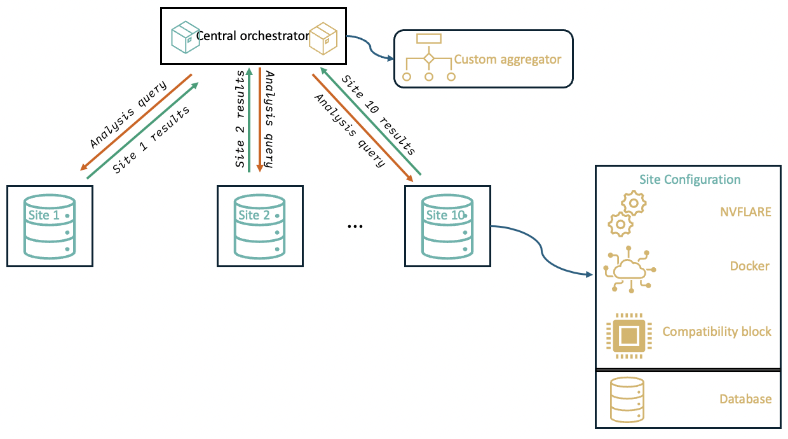

# FedGen: Federated Learning Infrastructure & Synthetic Genomic Data


## Contributors
1. Holger Roth
2. Pravesh Parekh
3. Srikant Sarangi
4. Md Enamul Hoq
5. Espen Hagen
6. Mariona Jaramillo Civill
7. Ioannis Christofilogiannis
8. Konstantinos Koukoutegos

---

## Table of Contents
- [Quickstart](#quickstart----server-and-clients-configuration)
- [Manuscript](#manuscript)
  - [Introduction](#introduction)
  - [Goals](#goals)
  - [Methods](#methods)
  - [Results](#results)
  - [Future Directions](#future-direction)
- [Data Documentation](#data-specifications)
- [Detailed Setup](#detailed-setup-instructions)
- [Troubleshooting](#troubleshooting)
- [References](#references)

---

# Quickstart -- Server and Clients Configuration

## 1. Start NVFLARE Dashboard on AWS

Follow the official NVFLARE documentation exactly:

📖 **NVFLARE Cloud Deployment – Create Dashboard on AWS**
[https://nvflare.readthedocs.io/en/2.4/real_world_fl/cloud_deployment.html#create-dashboard-on-aws](https://nvflare.readthedocs.io/en/2.4/real_world_fl/cloud_deployment.html#create-dashboard-on-aws)

High‑level summary:

* Create required AWS resources (EC2, security groups, IAM role)
* Install Docker & NVFLARE Dashboard
* Expose dashboard ports (typically 443 / 8443)
* Verify dashboard access from browser

> Refer to the official docs for the authoritative and up‑to‑date AWS steps.

---

## 2. Start NVFLARE Client on Brev

### 2.1 Create GPU Instance on Brev

On the **Brev website**:

* Create **1 GPU instance** per site
* Example configuration:
  * Name: `site1`
  * GPU: **1× NVIDIA L4**
  * CPU: **16 cores**
  * RAM: **64 GB**

---

### 2.2 Connect to the Instance

```bash
brev shell site1
```

Use terminal multiplexer to ensure connection persistence (Optional but recommended)

```bash
tmux new -s nvflare
```

---

### 2.3 Python Environment Setup

```bash
python3 -m venv venv_nvflare
source venv_nvflare/bin/activate

pip install nvflare[PT] torch torchvision tensorboard
```

Verify installation:

```bash
nvflare --version
```

---

## 3. Copy and Start NVFLARE Client Startup Kit

### 3.1 Copy Client Kit from Local Machine

On **local machine**:

```bash
brev copy <local_path_to_client_kit> site1:<remote_path>
```

On **Brev instance**:

```bash
sudo apt update
sudo apt install -y unzip

unzip -d <client_name> -P <PIN> <client_kit.zip>
cd <client_name>
```

### 3.2 Start NVFLARE Client

```bash
./startup/start.sh
```

Check logs to confirm successful connection to the NVFLARE server/dashboard.

---

## 4. Install AWS CLI on Each Brev Instance

From your **home directory**:

```bash
curl "https://awscli.amazonaws.com/awscli-exe-linux-x86_64.zip" -o "awscliv2.zip"
unzip awscliv2.zip
sudo ./aws/install
```

Verify:

```bash
aws --version
```

---

### 4.1 Configure AWS Credentials (Securely)

```bash
aws configure
```

Use **one** of the following secure approaches:

* IAM role attached to the instance (**recommended**)
* Environment variables (`AWS_ACCESS_KEY_ID`, `AWS_SECRET_ACCESS_KEY`)
* AWS credentials file

Example (DO NOT hardcode secrets):

```
AWS Access Key ID:     <YOUR_ACCESS_KEY>
AWS Secret Access Key: <YOUR_SECRET_KEY>
Default region name:  None
Default output format: None
```

---

## 5. Clone FedGen Repository

```bash
git clone https://github.com/collaborativebioinformatics/FedGen
chmod +x FedGen/scripts/*.sh
```

---

## 6. Download Site Data from S3

```bash
cd ~
mkdir -p data
cd data

./../FedGen/scripts/download_site_from_s3.sh <siteNumber>
```

Where:

* `<siteNumber>` corresponds to the site ID (e.g. `1`, `2`, `3`)
* Each site downloads ~15 GB of genomic data

---

## 7. Optional: Run Regenie Per Site (Outside NVFLARE)

Run Regenie independently per site (not through NVFLARE) to verify all dependencies are working:

```bash
cd ~/data
./../FedGen/scripts/run_regenie_site.sh <siteNumber>
```

Monitor logs and outputs to confirm successful completion.

**Runtime:** ~30-45 minutes total
- Step 1 (LOCO model): 15-30 min
- Step 2 (association testing): 10-20 min

---

## 8. Notes & Best Practices

* Use **one Brev instance per NVFLARE client**
* Always run NVFLARE client inside a virtual environment
* Prefer **IAM roles** over static AWS credentials
* Validate GPU availability:

  ```bash
  nvidia-smi
  ```
* Use `tmux` or `screen` to keep long‑running jobs alive

---

# Manuscript

## Introduction

Large-scale genomic studies increasingly rely on multi-site collaboration to achieve sufficient statistical power for complex disease analysis. However, sharing individual-level genomic data across institutions is often constrained by privacy regulations, ethical considerations, and governance policies. Federated learning (FL) offers a promising paradigm to address these challenges by enabling collaborative model training without centralizing raw data. 

This project aims to design and evaluate an end-to-end federated learning framework for genome-wide association‑style analyses using realistically simulated genotype and phenotype data. Synthetic genomic datasets are generated to closely resemble real-world data properties, including linkage disequilibrium (LD) structure, per-site variability, covariates, and site-level data imbalance. On top of this synthetic data layer, a federated learning infrastructure is deployed using an FL server‑client architecture using NVFlare on AWS. 

Multiple client sites represent independent data holders with heterogeneous sample sizes and phenotype distributions, while our learning task is focused on binary phenotype prediction (Parkinson's disease case/control status) using a logistic regression predictor.

## Goals

The goal of this project is to establish a realistic and extensible experimental framework for federated learning in genomics by combining synthetic data generation, scalable infrastructure, and privacy-aware modeling. 

Specifically, we aim to:

1. **Generate biologically plausible synthetic data** with preserved LD structure, standardized genome builds, and meaningful covariates, while enabling per-site heterogeneity that mirrors real-world cohort imbalance

2. **Deploy and evaluate a federated learning system** using NVFlare on cloud infrastructure, supporting multiple client sites, containerized workflows, and continuous monitoring and validation

3. **Implement a state-of-the-art genotype‑phenotype statistical model** trained directly from PLINK-formatted data, using a custom federated training aggregator strategy

4. **Quantify the framework's performance, robustness, and scalability** across heterogeneous data distributions

## Methods

### 1. Synthetic Data Generation

We generated realistic synthetic datasets for 10 different sites using the LDAK software [https://dougspeed.com/downloads/]. 

**Phenotype Simulation:**
- **Trait:** Parkinson's disease case-control status
- **Prevalence:** 1% (realistic for elderly populations)
- **SNP heritability:** h² = 0.25 on liability scale
- **Causal variants:** 20 SNPs per site
- **Effect size model:** LDAK-Thin with power = -0.25
- **Covariates:** Age and sex, explaining ~10% of phenotypic variance

**Genotype Simulation:**
- **Variants per site:** 450,000-520,000 SNPs (varied across sites)
- **Sample size per site:** 88,000-110,000 individuals
- **Chromosomes:** 22 autosomes
- **Build:** hg38
- **LD structure:** Realistic, generated by LDAK
- **MAF:** Uniform distribution 0.01-0.5

This resulted in synthetic data across 10 sites with varied numbers of subjects, slightly different numbers of genotyped SNPs, and different distributions of age and sex. The code for simulation can easily be modified to introduce further imbalance/skewness with respect to sample size, number of SNPs, or even introduce differences in the number of causal variants per site.


### 2. Federated Learning Strategy

Federated learning was implemented using a centralized server‑client architecture orchestrated with NVFlare. 

**Server Configuration:**
- Deployed on an AWS compute instance
- Served as coordinator for model aggregation, round management, and secure communication
- Dedicated Python virtual environment (venv) for dependency isolation
- Persistently active throughout training to manage federated rounds

**Client Configuration:**
- 10 independent compute instances provisioned using Brev
- Each client ran inside a Docker container for environmental consistency
- Client containers built from common Docker image with identical package versions
- NVFlare 2.7.1 used across all clients

**Privacy-Preserving Design:**
- Each client connects to central AWS-hosted server
- Participates in synchronous federated learning rounds
- Trains model locally on private data
- Transmits only model parameters back to server
- **Raw data never leaves client environments**



### 3. Meta-Analysis (Aggregation)

Within the GWAS world, there are two well-established approaches for performing meta-analysis ("aggregation" across sites): fixed-effects meta-analysis and random-effects meta-analysis. 

**Fixed-Effects Meta-Analysis:**
- Once we have performed GWASes for each site, summary statistics include the beta coefficient and standard error for each genetic variant
- Inverse variance weighted-summing of beta coefficients to get overall effect size
- Does not account for between-study (or between-site) variances

**Random-Effects Meta-Analysis:**
- Explicitly accounts for between-site variance
- Includes a variance component estimated based on heterogeneity test
- Implemented via call to GWAMA software (Mägi et al., 2010)

**Implementation:**
1. Output from site-specific GWASes reorganized to meet GWAMA required format
2. Within aggregator function, perform system call to GWAMA tool
3. Reformat output from GWAMA to match requirements for NVFLARE ecosystem

Our approach allows users to perform both types of meta-analyses.


## Results

[Results section to be completed]

## Future Direction

[Future directions to be completed]

---

# Project Architecture

## Flow Chart


## Federated Design

```
┌─────────────────────────────────────────────────┐
│         FL Server (NVIDIA FLARE on AWS)          │
│         (aggregates summary statistics)          │
└───────┬─────────┬─────────┬──────────┬─────────┘
        │         │         │          │
    ┌───▼───┐ ┌──▼────┐ ┌──▼────┐  ┌──▼────┐
    │Site 1 │ │Site 2 │ │Site 3 │  │Site N │
    │100K   │ │95K    │ │110K   │  │~10    │
    │samples│ │samples│ │samples│  │Brev   │
    └───────┘ └───────┘ └───────┘  └───────┘
     Local      Local     Local      instances
     GWAS       GWAS      GWAS       
```

---

# Project Structure

```
FedGen/
├── README.md                           # This file
├── scripts/
│   ├── download_site_from_s3.sh       # Download site data from S3
│   ├── run_regenie_site.sh            # Run REGENIE GWAS analysis
│   └── generate_federated_sites.sh    # Generate synthetic data (admin)
├── tools/
│   └── ldak6.1.mac                    # LDAK binary (gitignored)
├── data/
│   └── simulated_sites/
│       ├── site1/                     # Site 1 data (after download)
│       │   ├── site1_geno.bed/bim/fam # Genotypes (PLINK format)
│       │   ├── site1_pheno.pheno      # Phenotype
│       │   └── site1_geno.covar       # Covariates
│       ├── site2/                     # Site 2 data
│       └── ... (sites 3-10)
├── resources/
│   ├── Fed_learning_infrastructure_logo.png
│   ├── Fed_learning_infrastructure.drawio.svg
│   ├── Methods_simulationDetails.svg
│   ├── Methods_MetaAnalysis.svg
│   ├── fl_architecture.png
│   └── site1_gwas_results/            # Example REGENIE outputs
└── src/                                # Source code
    └── nvflare_workflows/             # FL workflows
```

---

# Data Specifications

## Genotypes
- **Format:** PLINK binary (.bed/.bim/.fam)
- **Variants:** ~500K SNPs (450K-520K per site)
- **Samples:** ~100K individuals (88K-110K per site)
- **Chromosomes:** 22 autosomes
- **Build:** hg38
- **MAF:** Uniform distribution 0.01-0.5
- **LD:** Generated by LDAK (realistic structure)

## Phenotype
- **File:** `site{N}_pheno.pheno`
- **Format:** Space-delimited (FID IID Pheno)
- **Trait:** Parkinson's disease (binary: 0=control, 1=case)
- **Prevalence:** 1% (realistic for elderly populations)
- **Heritability:** h² = 0.25 on liability scale
- **Causal variants:** 20 per site
- **Effect size model:** LDAK-Thin (power = -0.25)

## Covariates
- **File:** `site{N}_geno.covar`
- **Auto-generated by LDAK**
- **Variables:** Age, sex, and other demographic covariates
- **Variance explained:** ~10% of phenotypic variation

---

# Detailed Setup Instructions

## Prerequisites

### 1. Docker Desktop
```bash
# Install from: https://www.docker.com/products/docker-desktop/
# Ensure Docker is running before analysis
```

### 2. AWS CLI
```bash
# Install
brew install awscli

# Configure with your credentials
aws configure
# Enter: Access Key, Secret Key, Region (e.g., us-east-1)
```

### 3. Verify Setup
```bash
# Test Docker
docker --version
docker ps

# Test AWS access
aws s3 ls s3://flsynthdata/sitesdata/
```

---

## Download Workflow

```bash
# 1. Clone repository (if not already done)
git clone https://github.com/collaborativebioinformatics/FedGen.git
cd FedGen

# 2. Download your assigned site (e.g., Site 3)
./scripts/download_site_from_s3.sh 3

# 3. Verify download
ls -lh data/simulated_sites/site3/
# Should show ~15 GB total:
# - site3_geno.bed (~12-13 GB)
# - site3_geno.bim (~10-20 MB)
# - site3_geno.fam (~2-3 MB)
# - site3_pheno.pheno (~2 MB)
# - site3_geno.covar (~5-10 MB)
```

---

## REGENIE Analysis Workflow

### What REGENIE Does

**Step 1 - LOCO Prediction Model**
- Leave-One-Chromosome-Out ridge regression
- Builds polygenic prediction models
- Controls for genome-wide polygenic effects
- Output: Predictions for each chromosome

**Step 2 - Association Testing**
- Tests each SNP for association with Parkinson's
- Uses Firth regression (better for binary traits)
- Controls for covariates and polygenic background
- Output: Genome-wide association statistics

### Run Analysis

```bash
# Complete two-step GWAS
./scripts/run_regenie_site.sh 3

# Monitor progress
# Step 1: You'll see "Processing chromosome X..."
# Step 2: You'll see "Testing associations..."
```

---

## Understanding Results

### Output Files
```
regenie_step1.loco          # LOCO predictions
regenie_step1.log           # Step 1 log
regenie_step1_pred.list     # Prediction file list
regenie_step2_*.regenie     # Association results
regenie_step2.log           # Step 2 log
```

### Association Results Format
```
CHROM GENPOS ID ALLELE0 ALLELE1 A1FREQ N TEST BETA SE CHISQ LOG10P EXTRA
1     12345  rs123 A G 0.25 100000 ADD 0.05 0.02 6.25 3.2 ...
```

**Key columns:**
- `CHROM`: Chromosome number
- `GENPOS`: Base pair position
- `ID`: SNP identifier (rs number or chr:pos)
- `ALLELE0`: Reference allele
- `ALLELE1`: Alternate allele (tested)
- `A1FREQ`: Alternate allele frequency
- `BETA`: Effect size (log odds ratio for binary traits)
- `SE`: Standard error
- `LOG10P`: -log10(p-value) - higher = more significant

### Find Genome-Wide Significant Hits

```bash
# Genome-wide significance: p < 5e-8 (LOG10P > 7.3)
awk '$11 > 7.3' data/simulated_sites/site3/regenie_step2_*.regenie

# Top 20 associations
sort -k11 -gr data/simulated_sites/site3/regenie_step2_*.regenie | head -20
```

### Manhattan Plot (R)

```r
library(qqman)
results <- read.table("data/simulated_sites/site3/regenie_step2_*.regenie", header=TRUE)
results$P <- 10^(-results$LOG10P)
manhattan(results, chr="CHROM", bp="GENPOS", p="P", snp="ID")
```

---

# For Administrators

## Generate New Site Data

```bash
# Generate a single site (e.g., Site 1)
./scripts/generate_federated_sites.sh 1

# Runtime: 2-5 hours per site
# Disk space: ~15 GB per site
```

**Note:** LDAK binary must be in `tools/` directory:
```bash
# Download LDAK
curl -L -o tools/ldak6.1.mac https://github.com/dougspeed/LDAK/raw/main/ldak6.1.mac
chmod +x tools/ldak6.1.mac
```

## Upload Data to S3

```bash
# Upload single site
aws s3 sync data/simulated_sites/site1/ s3://flsynthdata/sitesdata/site1/ \
  --exclude "*" \
  --include "*.bed" \
  --include "*.bim" \
  --include "*.fam" \
  --include "*.pheno" \
  --include "*.covar"

# Upload all sites
for site in {1..10}; do
  aws s3 sync data/simulated_sites/site${site}/ s3://flsynthdata/sitesdata/site${site}/ \
    --exclude "*" \
    --include "*.bed" \
    --include "*.bim" \
    --include "*.fam" \
    --include "*.pheno" \
    --include "*.covar"
done
```

---

# Federated Learning Integration

This infrastructure enables:

1. **Privacy-Preserving GWAS**
   - Raw genotype data never leaves local sites
   - Only summary statistics are shared
   - Complies with data governance requirements

2. **Distributed Analysis**
   - Each site runs REGENIE locally
   - No centralized data repository needed
   - Sites can have different sample sizes
   - Imbalanced data distribution reflects real-world scenarios

3. **Meta-Analysis**
   - Aggregate LOG10P values across sites
   - Combine BETA estimates with inverse-variance weighting
   - Test for heterogeneity across sites
   - Support for both fixed-effects and random-effects methods

4. **Federated Learning Frameworks**
   - Compatible with NVIDIA FLARE
   - Can be adapted for other FL frameworks (Flower, PySyft)
   - Supports iterative model training
   - Logistic regression and PyTorch models

---

# Troubleshooting

## Download Issues

**AWS credentials error:**
```bash
# Reconfigure AWS CLI
aws configure

# Test access
aws s3 ls s3://flsynthdata/
```

**Slow download:**
```bash
# Check download speed
# Each site is ~15 GB, expect:
# - Fast connection (100 Mbps): ~20 minutes
# - Typical home (25 Mbps): ~1-2 hours
```

---

## Docker Issues

**Docker not running:**
```bash
# Start Docker Desktop application
# Wait for "Docker Desktop is running" message
```

**Image pull fails:**
```bash
# Manually pull REGENIE image
docker pull ghcr.io/rgcgithub/regenie/regenie:v4.1.gz

# If still fails, check internet connection
```

**Platform warning (Apple Silicon):**
```
WARNING: The requested image's platform (linux/amd64) does not match...
```
This is expected on M1/M2/M3 Macs. REGENIE will work via Rosetta emulation.

---

## REGENIE Errors

**"Phenotype file not found":**
- Check file paths are correct
- Ensure you're running from project root
- Verify site data was downloaded completely

**Out of memory:**
```bash
# Increase Docker memory allocation
# Docker Desktop → Settings → Resources → Memory
# Increase to 8-16 GB
```

**Step 1 takes very long:**
- Expected: 15-30 minutes for 100K samples
- If >1 hour, check system resources
- Consider using `--lowmem` flag (already included)

---

## Disk Space

**Requirements:**
- Each site: ~15 GB (raw data)
- REGENIE results: ~1-2 GB per site
- Total: ~17 GB per site

**Check available space:**
```bash
df -h .
```

---

# Technologies

- **Data Generation:** [LDAK](https://dougspeed.com/) v6.1
- **GWAS Analysis:** [REGENIE](https://rgcgithub.github.io/regenie/) v4.1
- **Meta-Analysis:** [GWAMA](https://genomics.ut.ee/en/tools/gwama)
- **Containerization:** Docker
- **Data Storage:** AWS S3
- **FL Framework:** NVIDIA FLARE 2.7.1
- **Compute:** Brev instances for distributed sites

---

# References

## Software Citations

- **LDAK:** Speed et al. (2020). Improved heritability estimation from genome-wide SNPs. *Nature Genetics*. https://doi.org/10.1038/s41588-019-0530-8

- **REGENIE:** Mbatchou et al. (2021). Computationally efficient whole-genome regression for quantitative and binary traits. *Nature Genetics*. https://doi.org/10.1038/s41588-021-00870-7

- **GWAMA:** Mägi et al. (2010). GWAMA: software for genome-wide association meta-analysis. *BMC Bioinformatics*. https://doi.org/10.1186/1471-2105-11-288

- **This project:** [Add citation when published]

## Documentation Links

- **NVFLARE Documentation:** [https://nvflare.readthedocs.io/](https://nvflare.readthedocs.io/)
- **FedGen Repository:** [https://github.com/collaborativebioinformatics/FedGen](https://github.com/collaborativebioinformatics/FedGen)
- **Brev Platform:** [https://brev.dev](https://brev.dev)
- **REGENIE Documentation:** https://rgcgithub.github.io/regenie/
- **LDAK Documentation:** https://dougspeed.com/
- **PLINK File Formats:** https://www.cog-genomics.org/plink/1.9/formats

---

# Support

For questions or issues:
- Open an issue on GitHub: https://github.com/collaborativebioinformatics/FedGen/issues
- Contact hackathon organizers
- Check script logs in `data/simulated_sites/site{N}/regenie_*.log`

---

# License

Data and scripts: MIT License (see repository root)
